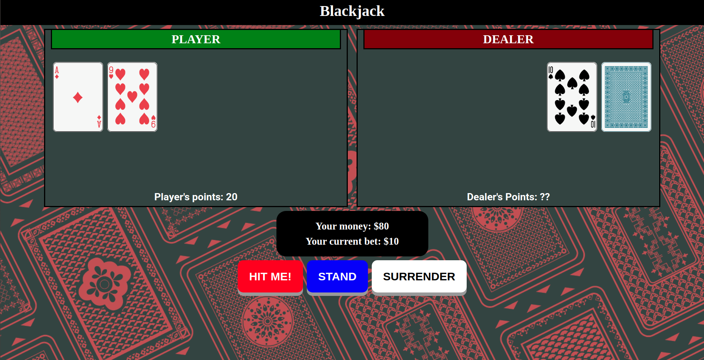

Title: BlackJack

Url: https://nbinged.github.io/BlackJack/

This is a dynamic online recreation of the globally popular card game which is only known as Twenty One or BlackJack. One of most widely played casino banking game in the world. 

For this game, it is a comparing card game between the player and a dealer, where the player competes against the dealer. It is played with a deck of 52 cards.

The objective of the game is to beat the dealer in one of the following ways:
- Get 21 points on the player's first two cards (called a "blackjack" or "natural")
- Reach a final score higher than the dealer without exceeding 21;
- Let the dealer draw additional cards until their hand exceeds 21 ("busted").

Features: 
- Randomized card dealing with shuffled decks everytime the game starts.
- Visual display of the cards recieved and a points system to keep track of your current points.
- Ability to 'HIT'(Add card), STAND(End your turn) and a in game currency betting system. In which you have to risk placing a   small minimum bet against the dealer to play.
- Automated dealer function to play against. Created with real world dealer rules to ensure realistic play.

Technologies used:
Javascript, HTML, CSS.
 
Approach taken:
The game is built mainly with Javascript. Hence using DOM manipulation and event listeners, the game takes in input though the click of the few game buttons. DOM manipulation to display, player score, win-lose status and cards dealt.
